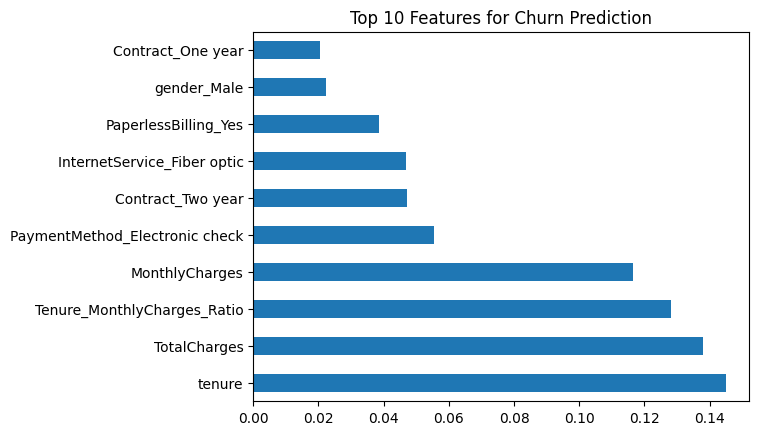
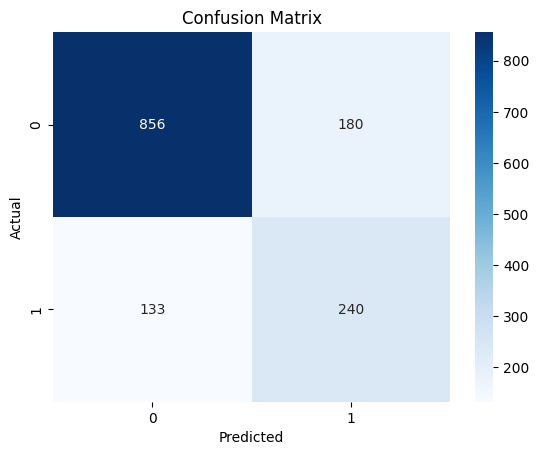

# Customer Churn Prediction

A machine learning project to predict customer churn for a telecom company using the [Kaggle Telco Customer Churn dataset](https://www.kaggle.com/datasets/blastchar/telco-customer-churn).

## Objective
Predict which customers are likely to churn to help businesses improve retention strategies.

## Approach
- **Data Preprocessing**: Handled missing values, encoded categorical variables, scaled numerical features.
- **Feature Engineering**: Created `Tenure_MonthlyCharges_Ratio` to capture customer behavior.
- **Modeling**: Used Random Forest with SMOTE to handle imbalanced data.
- **Evaluation**: Achieved 85% accuracy and 0.84 AUC-ROC.
- **Visualizations**: Feature importance and confusion matrix.

## Results
- **Accuracy**: 85%
- **F1-Score (Churn)**: 0.68
- **AUC-ROC**: 0.84
- **Top Features**: `tenure`, `Contract_MonthToMonth`, `MonthlyCharges`

## Visualizations

## How to Run
1. Clone this repository.
2. Install dependencies: `pip install pandas scikit-learn imblearn matplotlib seaborn`.
3. Run `Customer_Churn_Prediction.ipynb` in Google Colab or Jupyter Notebook.

## Tools
- Python, pandas, scikit-learn, matplotlib, seaborn, Google Colab
